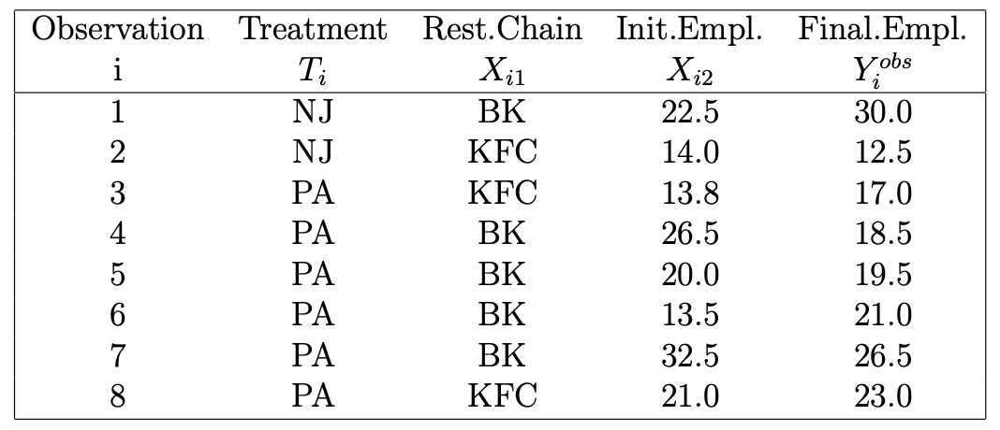

## Problem on Matching

### Course Instructor : Dr. Rahul Makhijani

Consider the data for 8 fast food restaurants that were part of a study of the effect of raising the minimum wage in NJ. The treatment group is the 2 restaurants in NJ and the control group is a set of 6 restaurants in PA(where the minimum wage was not raised). The outcome Y obs is the number i of people employed (including part time employees) at the end of the year. There are two covariates – Xi1, the identify of the fast food chain (Burger King or Kentucy Fried Chicken) and Xi2, employment at the end of the year prior to the increase in the minimum wage.

---

---

1. We want to use matching to estimate the effect of raising the minimum wage assuming that unconfoundedness holds. We will match a single control unit with each treatment unit (without replacement). Our dis- tance measure is D(i, j) = 100 ∗ I(Xi1 ̸= Xj1) + |Xi2 − Xj2| where the indicator I is 1 if the two units are different chains and 0 if they are the same chain. Identify the matches for the 2 treatment units.

2. What is the estimate of the average treatment effect on the treated units (ATT)?
Average Treatment Effect of the Treated (ATT) is the average of the individual treatment effects of those treated (hence not the entire pop- ulation).

3. An alternative estimand is the average treatment effect (ATE). Which estimand makes more sense here? Briefly justify your answer.

#### Source: STAT 265 course by Prof. Hal Stern